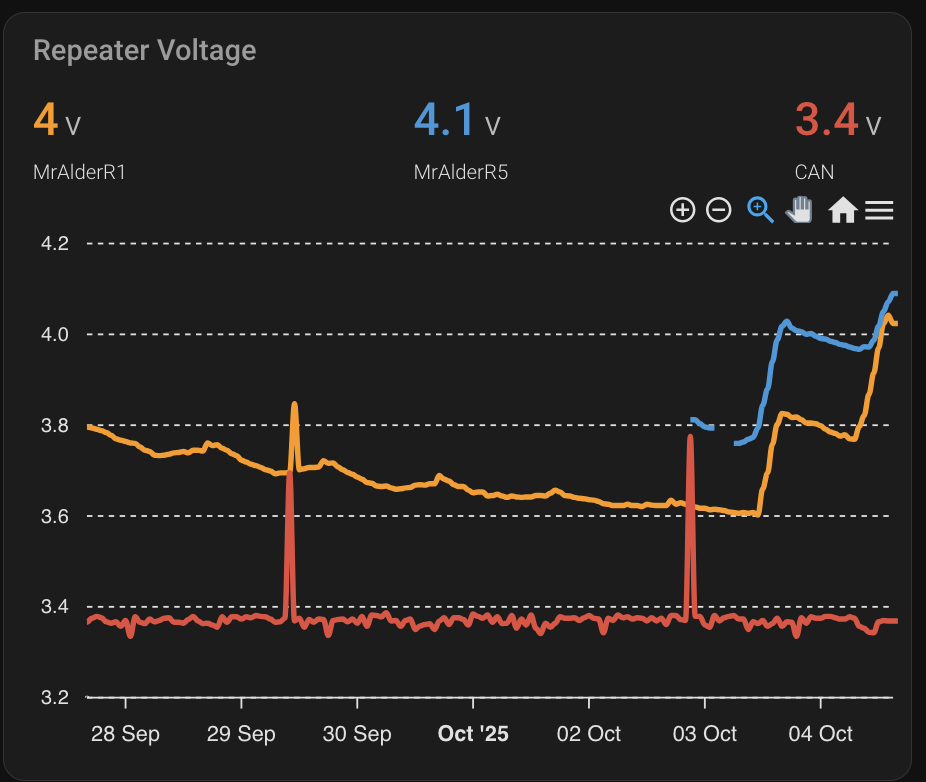
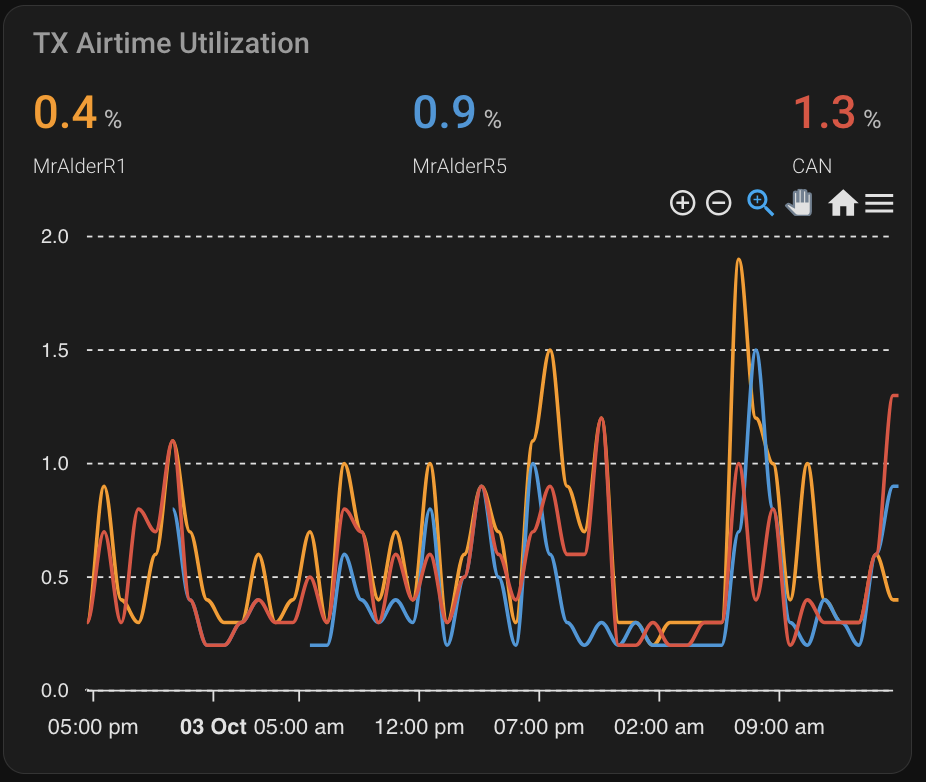
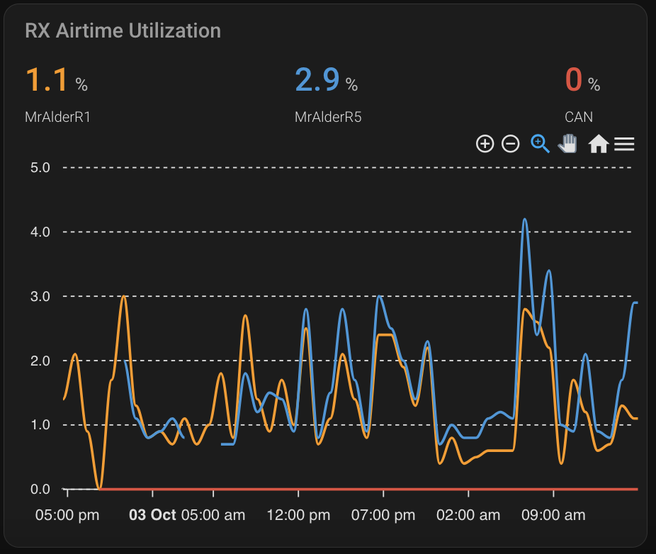
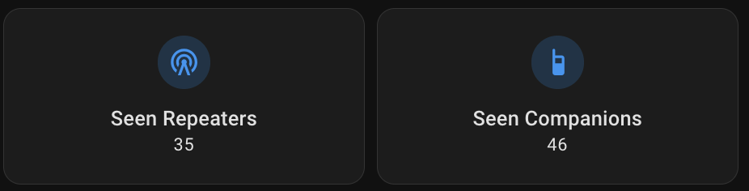
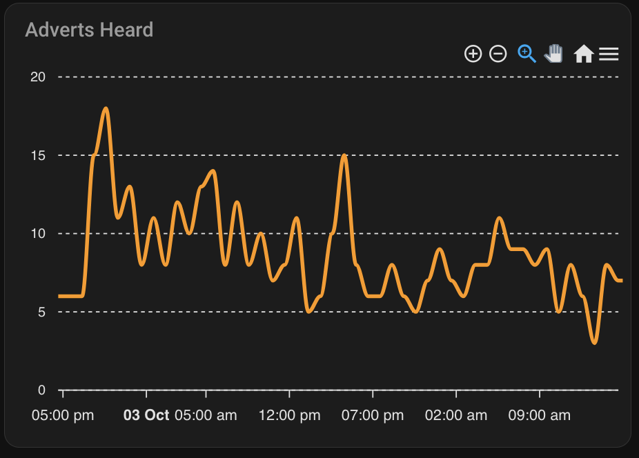

# 📊 MeshCore-HA · Dashboard Examples

Example **Lovelace cards** for visualizing MeshCore network health and activity in Home Assistant.  
These cards assume you already have the automations and sensors from this repository set up.

---

## ⚡ Repeater Voltage

Displays real-time voltage telemetry from your repeater nodes.



```yaml
type: custom:apexcharts-card
header:
  show: true
  title: Repeater Voltage
  colorize_states: true
  show_states: true
all_series_config:
  stroke_width: 3
  curve: smooth
  group_by:
    func: max
    duration: 60min
graph_span: 168h
apex_config:
  legend:
    show: false
  chart:
    zoom:
      enabled: true
    toolbar:
      show: true
      tools:
        zoom: true
        zoomin: true
        zoomout: true
        pan: true
        reset: true
series:
  - entity: sensor.meshcore_4e3192dcbb_bat_mralders0n_r1
    name: MrAlderR1
  - entity: sensor.meshcore_b76b620cd8_bat_mralders0n_r5
    name: MrAlderR5
  - entity: sensor.meshcore_921578e085_bat_can
    name: CAN
```

---

## 📡 Repeater TX Utilization

Graphs the percentage of time each repeater spent transmitting.  
Useful for spotting overloaded or chatty nodes.



```yaml
type: custom:apexcharts-card
header:
  show: true
  title: TX Airtime Utilization
  colorize_states: true
  show_states: true
all_series_config:
  stroke_width: 2
  curve: smooth
  group_by:
    func: max
    duration: 60min
graph_span: 48h
apex_config:
  legend:
    show: false
  chart:
    zoom:
      enabled: true
    toolbar:
      show: true
      tools:
        zoom: true
        zoomin: true
        zoomout: true
        pan: true
        reset: true
series:
  - entity: sensor.meshcore_4e3192dcbb_airtime_utilization_mralders0n_r1
    name: MrAlderR1
  - entity: sensor.meshcore_b76b620cd8_airtime_utilization_mralders0n_r5
    name: MrAlderR5
  - entity: sensor.meshcore_921578e085_airtime_utilization_can
    name: CAN
```

---

## 📥 Repeater RX Utilization

Similar to TX, this tracks the receive window activity.  
When combined with TX utilization, it provides a full view of channel congestion.



```yaml
type: custom:apexcharts-card
header:
  show: true
  title: RX Airtime Utilization
  colorize_states: true
  show_states: true
all_series_config:
  stroke_width: 2
  curve: smooth
  group_by:
    func: max
    duration: 60min
graph_span: 48h
apex_config:
  legend:
    show: false
  chart:
    zoom:
      enabled: true
    toolbar:
      show: true
      tools:
        zoom: true
        zoomin: true
        zoomout: true
        pan: true
        reset: true
series:
  - entity: sensor.meshcore_4e3192dcbb_rx_airtime_utilization_mralders0n_r1
    name: MrAlderR1
  - entity: sensor.meshcore_b76b620cd8_rx_airtime_utilization_mralders0n_r5
    name: MrAlderR5
  - entity: sensor.meshcore_921578e085_rx_airtime_utilization_can
    name: CAN
```

---

## 👥 Count of Seen Companions and Repeaters

Quick summary of how many **client nodes** and **repeaters** your network has heard recently.



```yaml
type: custom:mushroom-entity-card
entity: sensor.meshcore_known_repeaters
name: Seen Repeaters
icon: mdi:radio-tower
layout: vertical
```

```yaml
type: custom:mushroom-entity-card
entity: sensor.meshcore_known_companions
name: Seen Companions
icon: mdi:radio-handheld
layout: vertical
```

> 🧮 These sensors are based on the JSON entries from the known-list files (see [`MeshCore-Bot-Welcome.md`](MeshCore-Bot-Welcome.md) and [`MeshCore-Bot-NewRepeater.md`](MeshCore-Bot-NewRepeater.md).


---

## 🕐 Historical Adverts per Hour

Displays a 48-hour graph of total adverts heard per hour (see automation: **Count Adverts**).



```yaml
type: custom:apexcharts-card
header:
  show: true
  title: Adverts Heard
  colorize_states: true
  show_states: true
all_series_config:
  stroke_width: 3
  curve: smooth
  group_by:
    func: max
    duration: 60min
graph_span: 48h
apex_config:
  legend:
    show: false
  chart:
    zoom:
      enabled: true
    toolbar:
      show: true
      tools:
        zoom: true
        zoomin: true
        zoomout: true
        pan: true
        reset: true
series:
  - entity: counter.meshcore_advert_total
    name: Advets
    show:
      in_header: false
      legend_value: false
```

> 📈 Requires the automation defined in [`MeshCore-Bot-CountAdverts.md`](MeshCore-Bot-CountAdverts.md).

---
